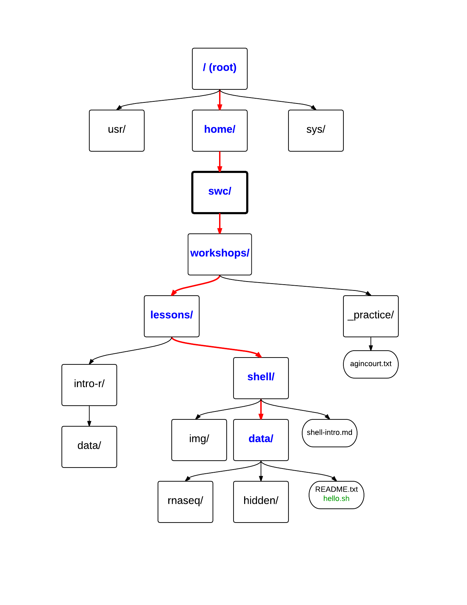

# Introduction to the UNIX shell

Modified from lessons for Data Carpentry with original contributions from Tracy Teal, Paul Wilson, Milad Fatenejad, Sasha Wood and Radhika Khetani.

Learn more:

- <http://datacarpentry.org/>
- <http://software-carpentry.org/>

## Objectives

-	What is the shell?
-	How do you access it?
-	How do you use it?
  -	Getting around the Unix file system
  -	looking at files
  -	manipulating files
  -	automating tasks
-	What is it good for?
-	Where are resources where I can learn more? (because the shell is awesome)

### Open the Virtual Machine

In order to avoid any operating system issues and to make sure we are all working on the same data, we will use a virtual machine.
We asked you to install VirtualBox on your computer and a to download a machine image. If you have not already done so, please open VirtualBox and import that machine image.
If you did *not* download the machine image prior to this class, please put up a *red* sticky note so that some one can bring you a flash drive with the image.


## What is the shell?

The *shell* is a program that presents a command line interface which allows you to control your computer using commands entered with a keyboard instead of controlling graphical user interfaces (GUIs) with a mouse/keyboard combination.

*Why should you care?*

- For 99% of bioinformatics tools, you have to use the shell (the command line). There is no graphical interface.
- The shell gives you *power*. The command line gives you the power to do your work more efficiently and more quickly. When you need to do things tens to hundreds of times, knowing how to use the shell is transformative.
- You have to use the shell to connect to remote computers.

### Automation

Have 10,000,000 files to rename, read in, analyze, and visualize? It's easy to automate things with the shell.


### How to access the shell
There are ways to access the shell on each operating system. Because some operating systems (Windows) have more trouble, we are using a Linux machine within the virtual image in order to learn how to use the shell. Should you wish to use it on your personal machine, please ask after class.

You access the shell through a program called a Terminal. You can see the terminal program icon in the top left corner of your screen. Please open a terminal window.

### More resources on the shell

Cheat sheets:

- <http://fosswire.com/post/2007/08/unixlinux-command-cheat-sheet/>

Web sites where you can see what the different components of a shell command are doing:

- [explainshell.com](http://explainshell.com)
- [commandlinefu.com](http://www.commandlinefu.com)


## Shell basics


### Moving around and listing files

We'll start out by moving around the file system and listing files. Today we're going to go through using the command line. These commands are on your handout (fixme).

Opening the terminal made it look a lot like we are in the Matrix, but it doesn't seem to be much more than a black screen, which is a little intimidating.
Every time you open a terminal, it will put you in the same starting directory, a *home* directory. A *directory* is the same thing as a *folder*. We just call folders *directories* in the Linux/UNIX world.
I may slip up now and then and say folder, so I apologize in advance.
Let's look at what I've put in your home directory:


```bash
ls
```

`ls` stands for 'list' and it lists the contents of a directory. More on `ls` in a second. You should see a **workshops** directory. We are going to move into that directory.

```bash
cd workshops
```

`cd` stands for 'change directory'. Here we just entered the workshops directory. If we were doing this on a graphical shell we would have double-clicked on a little folder icon. It's the same idea.

In this directory, there should be some things. Let's check. Type:

```bash
ls
```

Again, `ls` stands for 'list' and it lists the contents of a directory. This woudld be what you would see in the folder if you were doing this graphically on a desktop.

Blue things are directories, white things are files. It looks like we have two directories in this folder.

Now, let's go look in the 'data' directory in the 'shell' lesson. It's nested a few directories deep. To get to it, let's enter and list each directory like so:

```bash
cd lessons
ls
cd shell
ls
cd data
ls
```

In there, all mixed up together are regular files, directories, and an executable program. If we want to know which is which, we can type:

```bash
ls -F
```

Things with a `/` after it is a directory.  
Things with a `*` after them are programs.  
It there's nothing there it's a regular file.

You can also use the command:

```bash
ls -l
```

to see whether items in a directory are files or directories. It gives a lot more information too, such as the size of the file, who owns the file, etc.

So, we can see that we have several files, directories and a program. Great!

### Options

Most programs take additional options, or *flags*, that control their exact behavior. For example, `-F` and `-l` are options for `ls`. The `ls` program, like many programs, take a lot of options. But how do we know what the options are to particular commands?

Most commonly used shell programs have a manual, colloquially known as a *man page*. The joke here is so obvious that I probably don't need to make it, so, just know that once you know your Linux Kung-Fu you will be able to instead call up your *wo-man* page. In the meantime, let's open the manual page for `ls`.

You can access the manual using the `man` program.

```bash
man ls
```

Space key goes forward  
Or use the arrow keys to scroll up and down.  

When you are done reading, just hit `q` to quit. This can be a little confusing, so please let me know if you are having trouble leaving the `man` page.


Programs that are run from the shell can get extremely complicated, and each program can have dozens of flags. No one can learn all of them,  So, please don't stress out if you can't remember the arguments we discuss. You can always pull up the `man` page to look them up. I know that's what I do.


### The Unix directory file structure (a.k.a. where am I?)

As you've already just seen, you can move around in different directories or folders at the command line.

When you're working with bioinformatics programs, you're working with your data and it's key to be able to have that data in the right place and make sure the program has access to the data. Many of the problems people run in to with command line bioinformatics programs is not having the data in the place the program expects it to be.

We've given you a handout showing a few of the folders in the directory structure. This is **not** comprehensive, but it might help you visualize what's happening. Looking at the handout, we can see that there were several other files and folders we could have explored.

This is called a hierarchical file system structure, like an upside down tree with root (/) at the base that looks like this.



That (/) at the base is often also called the 'top' level.

When you are working at your computer or log in to a remote computer, you are on one of the branches of that tree, your home directory: **/home/username**. In this case our username is **swc**, but, for example, if I log-on to the UVa server, it would be my UVa computing ID. As I mentioned previously, this starting directory, which bears your name, is your 'home base' within the directory structure. It's where a new terminal will open.

If we type `cd` by itself:

```bash
cd
```

This puts you in your home directory. That's **/home/swc**

---

**EXERCISE**

-	Using `cd` and `ls`, go in to the 'workshops/lessons/shell/data' directory and list its contents.
-	How many files, how many directories and how many programs are there?

---

### Where am I?

Let's also check to see where we are. Sometimes when we're wandering around in the file system, it's easy to lose track of where we are and get lost.

If you want to know what directory you're currently in, type:

```bash
pwd
```

This stands for 'print working directory'. That's the directory you're currently working in, and it's "printed" to the screen.

What if we want to move back up and out of the `data` directory? To go 'back up a level' we need to use `..`

```bash
cd ..
```

Now do `ls` and `pwd`. See now that we went back up in to the 'shell' directory. `..` means "the directory above," or "the parent directory."

---

**EXERCISE**

Let's go on a file hunt. Move around in the "shell/data/hidden" directory and try to find the file "youfoundit.txt."

---

### Examining the contents of other directories

By default, the `ls` commands lists the contents of the working directory (i.e. the directory you are in). You can always find the directory you are in using the `pwd` command. However, you can also give `ls` the names of other directories to view. Navigate to the home directory if you are not already there using `cd` by itself, then `ls` the contents of the "workshops/lessons/shell" directory:

```bash
cd
ls workshops/lessons/shell
```

This listed the contents of workshops/lessons/shell without navigating there.

The `cd` command works the same way. Try entering:


```bash
cd
cd workshops/lessons/shell/data/hidden
```

and you will jump directly to `hidden` without having to go through the intermediate directories.

---

**EXERCISE**

Try finding the 'anotherfile.txt' file without changing directories.

---


### HUGE Shortcut: Tab Completion

Navigate to the home directory. 

Computer Scientists are *really lazy*, and all of this typing of directory names starts to feel like work. Luckily, the Computer Scientists who built the UNIX system anticipated our pain. When you start typing out the name of a file or directory, then hit the tab key, the UNIX shell will try to fill in the rest of the directory name. For example, enter:

```
cd
cd w<tab>
```

The shell will fill in the rest of the directory name for "workshops". Now go to `workshops/lessons/intro-r/data/`

```
cd
cd wo<tab>le<tab>int<tab>da<tab>
```

Now type `ls small-0` and hit tab twice.

```
ls small-0<tab><tab>
```

When you hit the first tab, nothing happens. The reason is that there are multiple directories in the directory which start with `small-0`. Thus, the shell does not know which one to fill in. When you hit tab again, the shell will list the possible choices.

You'll notice that the terminal is now waiting for you to finish typing the name of the file, but we want to move forward without doing anything with any of those files. In order to get back to a new line, type `ctrl + c`. This works no matter what you are doing on the command line - if you want to stop doing what you are doing, hit `ctrl + c`.

**Handy Sidenote:** Tab completion can also fill in the names of programs. For example, enter `e<tab><tab>`. You will see the name of every program that starts with an `e`. One of those is `echo`. If you enter `ec<tab>` you will see that tab completion works.

### Full vs. Relative Paths

The `cd` command takes an argument which is the directory name. Directories can be specified using either a *relative path* or a *full path*. The directories on the computer are arranged into a hierarchy. The full path tells you where a directory is in that hierarchy. Navigate to the home directory. Now, enter the `pwd` command and you should see:

```
/home/swc
```

which is the full name of your home directory. This tells you that you are in a directory called `swc`, which sits inside a directory called `home` which sits inside the very top directory in the hierarchy. The very top of the hierarchy is a directory called `/` which is usually referred to as the *root directory*. So, to summarize: `swc` is a directory in `home` which is a directory in `/`.

Now enter the following command, and don't forget to use tab completion to help you along:

```bash
ls /home/swc/workshops/lessons/shell/data/hidden
```

This shows us the contents of `hidden`. Now lets look at what we get when we give the command:

```bash
ls workshops/lessons/shell/data/hidden
```

And Look! We get the same result! But, instead of specifying the full path, we specified a *relative path*. In other words, we specified the path relative to our current directory. A full path always starts with a `/`. A relative path does not.

A relative path is like getting directions from someone on the street. They tell you to "go right at the Stop sign, and then turn left on Main Street". That works great if you're standing there together, but not so well if you're trying to tell someone how to get there from another country. A full path is like GPS coordinates. It tells you exactly where something is no matter where you are right now.

You can usually use either a full path or a relative path depending on what is most convenient. If we are in the home directory, it is more convenient to just enter the relative path since it involves less typing.

Over time, it will become easier for you to keep a mental note of the structure of the directories that you are using and how to quickly navigate them.

---

**EXERCISE**

-	List the contents of the /bin directory. Do you see anything familiar in there?

---

### Saving time with shortcuts and wild cards

#### Shortcuts
#### ~ Tilde

There are some shortcuts which you should know about. Dealing with the home directory is very common. In the shell the tilde character, `~`, is a shortcut for your home directory. The tilde key is located at the top left of your keyboard above the tab key.

```bash
ls ~
```

That's no big deal, since we are already in the home directory. But what if we weren't? Let's go to the workshops directory, like so:

```bash
cd
cd workshops
```

Then enter the command:

```bash
ls ~
```

This prints the contents of your home directory, without you having to type the full path. In this case we were only one directory away, but if we had been all the way down in the hidden folder, we wouldn't want to climb all the way back home just to have a peek at the contents.

#### .. Double Dot
The shortcut `..`, which I call 'double dot' or 'dot dot' always refers to the directory above your current directory.

So, from where we are in the `workshops/` folder

```bash
ls ..
```

prints the contents of the `/home/swc/`. You can chain these together, so:

```bash
ls ../../
```

prints the contents of `/home/`, two directories up from our current position.

#### . The Special Directory
Finally, the special directory `.` always refers to your current directory. So, `ls`, `ls .`, and `ls ././././.` all do the same thing, they print the contents of the current directory. This may seem trivial right now, but it's actually very useful. `ls` is able to be used on its own without specifying an argument because it 'understands' that, in the absence of a path, it should list the contents of the current directory, but not all programs can handle that. We'll see that later on.


To summarize, while you are in the `workshops` directory, the commands `ls ~`, `ls ../`, and `ls /home/swc` all do exactly the same thing.


#### Wild cards
In this example we're going to use some RNA-seq data which comes from RNA-seq done on skin cells treated with ultraviolet light versus controls ([paper](http://www.plosone.org/article/info%3Adoi%2F10.1371%2Fjournal.pone.0093338); [data](http://www.ncbi.nlm.nih.gov/geo/query/acc.cgi?acc=GSE54413)).


Navigate to the `workshops/lessons/shell/data/rnaseq/` directory from your home. This directory contains FASTQ files that are used during RNA-Seq. If we type `ls`, we will see that there are several files in there. Some of the end with `.fastq.gz`. That extra `.gz` extension tells us that these are compressed  files.

The `*` character is a shortcut for "everything". Thus, if you enter `ls *`, you will see all of the contents of a given directory. But what if you only want to see a certain subset of files in the directory?

```bash
ls *fastq.gz
```

This lists every file that ends with a `fastq.gz`. This command:

```bash
ls /usr/bin/*.sh
```

Lists every file in `/usr/bin` that ends in the characters `.sh`.

You will note that the location of the wildcard changed. You put the wildcard at the *beginning* when you don't care how a file name *starts* and at the *end* when you don't care how it *ends*.

If we wanted to list just the files whose names begin with certains letters, we could do this:

```bash
ls ctl*
ls uvb*
```

So how does this actually work? Well...when the shell sees a word that contains the `*` character, it automatically looks for filenames that match the given pattern. In this case, it identified 3 such files. Then, it replaced the `ctl*` with the list of files, separated by spaces.

This wild card is extremely useful for lazy computer scientists. For example, what if I wanted to extract all of these compressed files? The files were zipped using a program called `gzip` and they can be unzipped with a program called `gunzip` (pronunciation?) Instead of unzipping them one by one, how about we use:


```bash
gunzip *.gz
ls
```
When we look at the contents of the folder, we see that all of the `.gz` extensions are gone!

Now, time for some more practice with wildcards.

---

**EXERCISE**

Do each of the following using a single `ls` command without navigating to a different directory.
  -	List all of the files in `/bin` that start with the letter 'c
  -	List all of the files in `/bin` that contain the letter 'a'
  -	List all of the files in `/bin` that end with the letter 'o'

---

### Command History

Sometimes I want to repeat a command that I typed previously. I'm obviously much too lazy to re-type a really long command. Luckily, you can easily access previous commands. Hit the up arrow. Hit it again. You can step backwards through your command history. The down arrow takes your forwards in the command history.

`Control-C` will cancel the command you are writing, and give you a fresh prompt.

If the command you want to repeat is far back, it starts to feel like work to press the up arrow so much. Luckily, you can also review your recent commands with the `history` command to see a numbered list of commands you've run.

```bash
history
```

You can reuse one of these commands directly by referring to the number of that command. If your history looked like this:

```
259  ls *
260  ls /usr/bin/*.sh
261  ls ctl*
```


then you could repeat command `#260` by simply entering:

```
!260
```

---

**EXERCISE**

Find the line number in your history for the last exercise (listing files in /bin) and reissue that command.

---


### Examining Files

Navigate to the intro-r data folder.

```bash
cd
cd workshops/lessons/intro-r/data
```

We now know how to switch directories, run programs, and look at the contents of directories, but how do we look at the contents of files?

There are a multitude of programs you can use to look at your files -- we are only going to look at a couple of them, but there are plenty more. The easiest way to examine a file is to print out all of the contents using the program `cat`, which is short for 'concatenate'. Enter the following command:

```bash
cat car-speeds.csv
```

This prints out the contents of the `car-speeds.csv` file.


We did sequencing, and what we have here are just reads that came from a 100 MB region on chromosome 4. We want to be able to look at these files and do some things with them.

---

**EXERCISE**

-	Print out the contents of the `workshops/lessons/intro-r/small-01.csv` file. What does this file contain?
-	Without changing directories, use one short command to print the contents of all of the files in the `~/workshops/shell/data/words` directory.

---


Make sure we're in the right place for the next set of the lessons. We want to be in the rnaseq directory  (`workshops/lessons/shell/data/rnaseq`). Take a second to navigate there. One way to do that would be

```bash
cd ~/workshops/lessons/shell/data/rnaseq
```

`cat` is a terrific program, but when the file is really big, it can be annoying to use. For example, try:

```bash
cat ctl1.fastq
```
Wow. That looks like it could go on forever. If you don't want to watch it scroll by forever type `Control + C` to stop it.
The program, `less`, is useful when files are big and you want to be able to scroll through them.


```bash
less ctl1.fastq
```

`less` opens the file, and lets you navigate through it. The commands
are identical to the `man` program.


**Some commands in `less`**

| Key   | Action              |
|-------|---------------------|
| space | go forward          |
| b     | go backwards        |
| g     | go to the beginning |
| G     | go to the end       |
| q     | quit                |

`less` also gives you a way of searching through files. Just hit the "/" key to begin a search. Enter the name of the word you would like to search for and hit enter. It will jump to the next location where that word is found. Try searching `ctl1.fastq` for the sequence "GATTACA". If you hit "/" then "enter", `less` will just repeat the previous search. `less` searches from the current location and works its way forward. If you are at the end of the file and search for "GATTACA", `less` will not find it. You need to go to the beginning of the file with the `g` key in less, and start the search from there.

Remember, the `man` program actually uses `less` internally and therefore uses the same commands, so you can search documentation using "/" as well!

There's another way that we can look at files, and in this case, just look at part of them. This can be particularly useful if we just want to see the beginning or end of the file, or see how it's formatted.

In order to look at the first 10 lines of a file we can use:
```bash
head ctl1.fastq
```
In genomics, I work with files that are much much to big to open, but often I need to see the first line in order to learn my column names.

I can use the `-n` flag, followed by a number, to print only the first row of the file, like so:

```bash
head -n1 ctl1.fastq
```
Because of the way FASTQ files are formatted, each read is given in a group of four rows. So, to look at the first read we would type:


```bash
head -n4 ctl1.fastq
```

Just as `head` prints the first 10 lines of the file, there's another program that will print only the last 10 lines of the file. Can you guess what it's called?

```bash
tail ctl1.fastq
```
There are various reasons why you might want to take a quick look at the end of your file. Among others, you might want to make sure that the table is complete. If something got messed up during data production, you might have uneven or incomplete columns.
If you want to see only the last 4 lines of the file, in this case the last read, you can use the `-n` option.


```bash
tail -n 4 ctl1.fastq
```

### Searching files

I'm about to teach you the only word you will ever need to say to convince everyone that you are a command-line bad ass. Are you ready?

**grep**     *global regular expression parser* (?)

We showed a little how to search within a file using `less`.

Using `grep` we can search within files without even opening them. Grep is a command-line utility for searching plain-text data sets for lines matching a string or regular expression.

Let's find all the lines in ctl1.fastq that contain the sequence motif "GATTACA."

```bash
grep GATTACA ctl1.fastq
```

We get back just the sequence line, but what if we wanted all four lines, the whole part of that FASTQ sequence, back instead.

```bash
grep -B 1 -A 2 GATTACA ctl1.fastq
```

The `-A` flag stands for "after match" so it's returning the line that matches plus the two after it. The `-B` flag returns that number of lines before the match, so that's returning the fastq header.

---

**EXERCISE**

Search for the sequence 'GATTTTTACA' (GATTACA with 5 T's instead of 2) in ctl1.fastq file and in the output have the sequence name. The output should look like this:

```
@SRR1145047.5880759
AAGCTAAAAAAAAAATGGATGTTTCAGTTAAATGTTTTAAAGAGGTACAGATTTTTACAAGGACATAATATAAG
```

Next, search for that sequence in all the FASTQ files.

---

### Redirection & Pipes

We're excited we have all these sequences that we care about that we just got from the FASTQ files. Perhaps that was some really important motif that is going to help us answer some important question. But all those sequences just went whizzing by with grep. How can we capture them?

We can do that with something called "redirection". The idea is that we're redirecting the output to the terminal (all the stuff that went whizzing by) to something else. In this case, we want to write it to a file, so that we can look at it later.

We do this with: `>`.

Let's try it out and put all the sequences that contain 'GATTACA' from all the files in to another file called "gattaca-reads.txt".

```bash
grep GATTACA *.fastq > gattaca-reads.txt
```

The prompt should sit there a little bit, and then it should look like nothing happened. But type `ls`. You should have a new file called "gattaca-reads.txt". Take a look at it and see if it has what you think it should.

```bash
ls
less gattaca-reads.txt
```

There's another useful redirection command that we're going to show, and that's called the pipe: `|`. It's probably not a key on your keyboard you use very much. What `|` does is take the output that scrolling by on the terminal and then can run it through another command. When it was all whizzing by before, we wished we could just slow it down and look at it, like we can with `less`. Well it turns out that we can! We pipe the `grep` command through `less`

The pipe '|' takes the output of the first thing and then puts it in to the second part

```bash
grep GATTACA *.fastq | less
```

Now we can use the arrows to scroll up and down and use `q` to get out.

There's another command called `wc`. `wc` stands for`word count`. It counts the number of lines or characters. So, we can use it to count the number of lines we're getting back from our `grep` command. And that will tell us how many sequences we're finding with that motif across all the files.

```bash
grep GATTACA *.fastq | wc
```

That tells us the number of lines, words and characters in the file. If we just want the number of lines, we can use the `-l` flag for `lines`.

```bash
grep GATTACA *.fastq | wc -l
```

You could have piped the output to a file like you did the first time and ran `wc` on that file:

```bash
wc gattaca-reads.txt
```

But using the pipe you didn't need to create the intermediate file. Pipes are really powerful for stringing together these different commands, so you can do whatever you need to do.

The philosophy behind these command line programs is that none of them really do anything all that impressive. BUT when you start chaining them together, you can do some really powerful things really efficiently. If you want to be proficient at using the shell, you must learn to become proficient with the pipe (heh) and redirection operators.

For example, draw a cow saying the largest word in the available dictionary of the english language that contains the word "coin":

```bash
# Read in the system's dictionary.
cat /usr/share/dict/words
# grep for "coin"
cat /usr/share/dict/words | grep coin
# count letters in each word
cat /usr/share/dict/words | grep coin | awk '{print length($1), $1}'
# numeric sort
cat /usr/share/dict/words | grep coin | awk '{print length($1), $1}' | sort -n
# take the last line
cat /usr/share/dict/words | grep coin | awk '{print length($1), $1}' | sort -n | tail -n 1
# cut out the second field (-f 2) if the file were delimited by a space (-d " ")
cat /usr/share/dict/words | grep coin | awk '{print length($1), $1}' | sort -n | tail -n 1 | cut -d " " -f 2
# make the cow say it
cat /usr/share/dict/words | grep coin| awk '{print length($1), $1}' | sort -n | tail -n 1 | cut -d " " -f 2 | cowsay
#make a dragon say it
cat /usr/share/dict/words | grep coin | awk '{print length($1), $1}' | sort -n | tail -n 1 | cut -d " " -f 2 | cowsay -f dragon
```

This program piped together 7 UNIX programs (`cat`, `grep`, `awk`, `sort`, `tail`, `cut`, `cowsay`), each of which does a very small job on its own, and strung them together to do something pretty powerful (as silly as it may be).

```
 _______________________ 
< mechanicointellectual >
 ----------------------- 
      \                    / \  //\
       \    |\___/|      /   \//  \\
            /0  0  \__  /    //  | \ \    
           /     /  \/_/    //   |  \  \  
           @_^_@'/   \/_   //    |   \   \ 
           //_^_/     \/_ //     |    \    \
        ( //) |        \///      |     \     \
      ( / /) _|_ /   )  //       |      \     _\
    ( // /) '/,_ _ _/  ( ; -.    |    _ _\.-~        .-~~~^-.
  (( / / )) ,-{        _      `-.|.-~-.           .~         `.
 (( // / ))  '/\      /                 ~-. _ .-~      .-~^-.  \
 (( /// ))      `.   {            }                   /      \  \
  (( / ))     .----~-.\        \-'                 .~         \  `. \^-.
             ///.----..>        \             _ -~             `.  ^-`  ^-_
               ///-._ _ _ _ _ _ _}^ - - - - ~                     ~-- ,.-~
                                                                  /.-~
```

### Creating, moving, copying, and removing

Now we can move around in the file structure, look at files, search files, redirect. But what if we want to do normal things like copy files or move them around or get rid of them. Sure, if we had a desktop, we could do most of these things without the command line, but what fun would that be?! Besides it's usually faster to do it at the command line, or you'll be on a remote server like Amazon where you won't have another option.

The `coldata.csv` file tells us which sample names are which treatment (in this example the filenames are pretty informative, but when they come off the sequencer usually they won't be). This is a really important file, so we want to make a copy so we don't lose it.

Lets copy the file using the `cp` command. The `cp` command backs up the file. Navigate to the `data/rnaseq` directory and enter:

```bash
cp coldata.csv coldata.csv-backup
```

Now `coldata.csv-backup` has been created as a copy of `coldata.csv`.

Let's make a `backup` directory where we can put this file.

The `mkdir` command is used to make a directory. Just enter `mkdir` followed by a space, then the directory name.

```bash
mkdir backup
```

We can now move our backed up file in to this directory. We can move files around using the command `mv`. Enter this command:

```bash
mv coldata.csv-backup backup
```

This moves `coldata.csv-backup` into the directory `backup/` or the full path would be `~/workshops/lessons/shell/data/rnaseq/backup/coldata.csv-backup`

The `mv` command is also how you rename files. Since this file is important, let's rename it:

```bash
ls
mv coldata.csv coldata-IMPORTANT.csv
ls
```

Now let's delete the backup copy:

```bash
ls
ls backup
rm backup/coldata.csv-backup
ls
ls backup
```

The `rm` file removes the file. Be careful with this command. It doesn't just nicely put the files in the Trash. They're really gone.

---

**EXERCISE**

Do the following:

1.	Rename the `coldata-IMPORTANT.csv` file back to `coldata.csv`.
2.	Create a new directory in the rnaseq directory called `new`.
3.	Then, copy the `coldata.csv` file into `new`

---

Now lets remove the `new` directory that you just made. If we use:

```bash
rm new
```
it doesn't work. 
By default, `rm`, will NOT delete directories. You can tell `rm` to delete a directory and everything in it *recursively* using the `-r` option. Let's delete that `new` directory we just made. Enter the following command:

```bash
rm -r new
```

Be careful with this. With great power comes great responsibility.

### Writing files

We've been able to do a lot of work with files that already exist, but what if we want to write our own files. Obviously, we're not going to type in a FASTA file, but there are a lot of reasons we'll want to edit a file.

To write in files, we're going to use the program `nano`. Again, there are several different programs that can be used for this, but in this case we have decided to show you `nano`. We're going to create a file that contains a witty animal command. We'll name this file 'awesome.sh'.

```bash
nano awesome.sh
```

Enter the following into the file:

```bash
cowsay -f beavis.zen "Heheheh"

#or

cowsay -f ghostbusters "I ain't afraid!"
```

At the bottom of nano, you see the "^X Exit". That means that we use `Ctrl-X` to exit. Type `Ctrl-X`. It will ask if you want to save it. Type `y` for yes. Then it asks if you want that file name. Hit 'Enter'.


Now you've written a file. You can take a look at it with less or cat, or open it up again and edit it.

---

**EXERCISE**
1. Look at the possible shapes that can be used by `cowsay` with the command:
```bash
cowsay -l
```
2. Open 'awesome.sh' and edit the option after `-f` to be one of the other shape names from Step 1.
3. Add the command `echo "Done"` below the animal command.
4. Save the file.

We're going to come back and use this file shortly.

---

### Running programs

Commands like `ls`, `rm`, `echo`, and `cd` are just ordinary programs on the computer. A program is just a file that you can *execute*. The program `which` tells you the location of a particular program. For example:

```bash
which pwd
```

Will return "/bin/pwd". Thus, we can see that `pwd` is a program that sits inside of the `/bin` directory. Now enter:

```bash
which find
```

You will see that `find` is a program that sits inside of the`/usr/bin` directory.

So ... when we enter a program name, like `ls`, and hit enter, how does the shell know where to look for that program? How does it know to run `/bin/ls` when we enter `ls`. The answer is that when we enter a program name and hit enter, there are a few standard places that the shell automatically looks. If it can't find the program in any of those places, it will print an error saying "command not found". Enter the command:

```bash
echo $PATH
```

This will print out the value of the `PATH` environment variable. Notice that a list of directories, separated by colon characters, is listed. These are the places the shell looks for programs to run. If your program is not in this list, then an error is printed. The shell ONLY checks in the places listed in the `PATH` environment variable.

Remember that file where we wrote that cute animal command? If we want to see that animal, we need to run it. Usually scripts will contain things that you need to run often -- I don't know about you, but I need to see cute animals talking all the time! Let's try to run that script:

```bash
awesome.sh
```

You should get an error saying that awesome.sh cannot be found. That is because the directory `~/workshops/lessons/shell/data/rnaseq/` is not in the`PATH`. You can try again to run the `awesome.sh` program by entering:

```bash
./awesome.sh
```

Alas, we get `-bash: ./awesome.sh: Permission denied`. This is because we haven't told the computer that it's a program that can be executed. To do that we have to make it 'executable'. We do this by changing its mode. The command for that is `chmod` - change mode. We're going to change the mode of this file, so that it's executable and the computer knows it's OK to run it as a program.

To run a program, you have to set the right permissions, make it executable rather than just a text file.

```bash
chmod +x awesome.sh
ls -l
```

Now we can run the program

```bash
./awesome.sh
```

Now you should have seen some output, and of course, it's AWESOME! Congratulations, you just created your first shell script!

---

**EXERCISE**

1. In the `rnaseq` directory, use `nano` to write a script called `quickpeek.sh` that:
    * Runs `head` on all the fastq files in the current directory
    * Runs `wc` on all the fastq files
    * `echo`s "Done!" when finished.
2. Make the program executable.
3. Run the program.

---


## Where can I learn more about the shell?

-	Software Carpentry tutorial - [The Unix shell](http://software-carpentry.org/v4/shell/index.html)
-	The shell handout - [Command Reference](http://files.fosswire.com/2007/08/fwunixref.pdf)
-	[explainshell.com](http://explainshell.com)
-	<http://tldp.org/HOWTO/Bash-Prog-Intro-HOWTO.html>
- <http://stackoverflow.com/>
-	Google - if you don't know how to do something, try Googling it. Other people have probably had the same question.
-	Learn by doing. There's no real other way to learn this than by trying it out. Write your next paper in nano, open pdfs from the command line, automate something you don't really need to automate or actually do.
